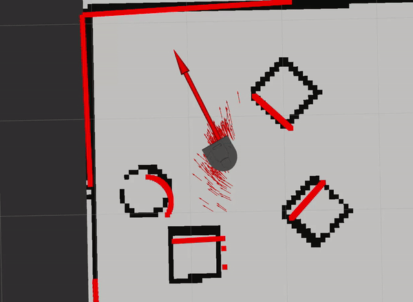
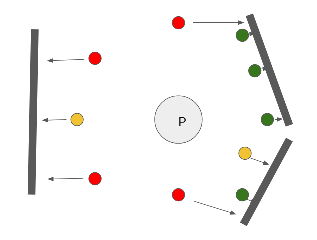
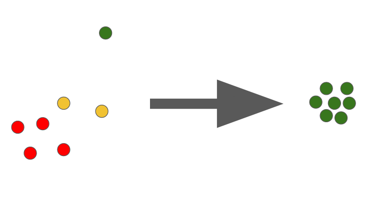
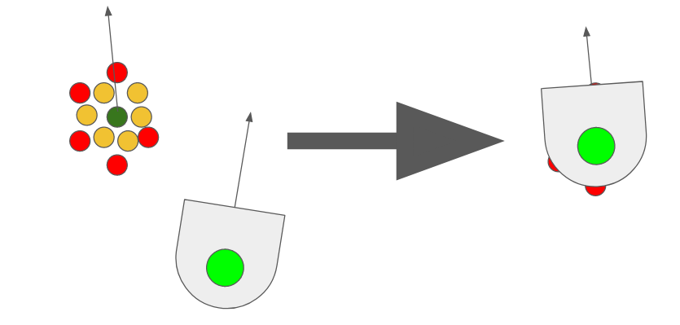
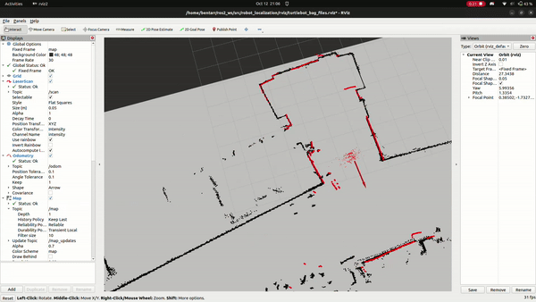

# robot_localization
Project by Dexter Friis-Hecht & Ben Tarr. Source code written by Paul Ruvolo

# Overview

The project is focused on an implementation of a particle-filter algorithm, which is used to localize a robot within a known environment. This is done in a couple of steps:
- A hypothetical position for the robot is initialized within the mapped area.
- "Particles" are distributed around this position. Each particle has its own pose, similarly to the robot.
- As the robot navigates the environment, its odometry data is used to update each particle's position.
- After each position update, laser scan readings from the robot are transferred onto each particle, and measured distances from obstacles are compared between the particles and robot.
- Particles with laser readings close to the robot readings are assigned a weight, with a greater weight the closer the particles are.
- Particles with a low weight are redistributed on the high weight particles.
- These new distributes are used to continuously update the robot's hypothetical position.
- Over time, as the robot moves about the environment more, the particles converge on the robot's true position, resulting in the robots position within the environment becoming known.

This report will go over each of these steps, detailing approach, actions the code performs, and limitations.


## Particle Cloud Initialization

We use the `initialize_particle_cloud` to create an initial cloud of particles around an assumed starting location. Because the starting location is not known with high precision, spreading the particles out with a gaussian distribution is helpful to allow the particles to efficiently converge on the true location of the robot.

To generate the gaussian distribution, the `np.random.normal` function is used in the following manner:
```python
for i in range(self.n_particles): # iterate once for each particle
    self.particle_cloud.append( # add the following particle to the cloud
        Particle( # create a new Particle object
            np.random.normal(xy_theta[0], xy_scale), # gaussian distribution for x
            np.random.normal(xy_theta[1], xy_scale), # gaussian distribution for y
            np.random.normal(xy_theta[2], theta_scale), # gaussian distribution for z
        )
    )
```

## Particle Position Update

Particle positions are updated with the **update_particles_with_odom():** function.
The function first samples the current pose of the robot. A pose contains x and y position, as well as rotation in radians (represented as theta). Both the current robot pose, as well as the
previous robot pose, are then stored in transformation matrices with the following format:

$$
\begin{bmatrix}
cos(\theta_0) & -sin(\theta_0) & x_0\\
sin(\theta_0) & cos(\theta_0) & y_0\\
0 & 0 & 1
\end{bmatrix}
$$

$$
\begin{bmatrix}
cos(\theta_1) & -sin(\theta_1) & x_1\\
sin(\theta_1) & cos(\theta_1) & y_1\\
0 & 0 & 1
\end{bmatrix}
$$

where the subscript 0 represents the previous position, and subscript 1 represents the new position. We can then find the difference, or delta, between these two transformation matrices with the following equation:

$$
\begin{bmatrix}
cos(\theta_0) & -sin(\theta_0) & x_0\\
sin(\theta_0) & cos(\theta_0) & y_0\\
0 & 0 & 1
\end{bmatrix}^- * 
\begin{bmatrix}
cos(\theta_1) & -sin(\theta_1) & x_1\\
sin(\theta_1) & cos(\theta_1) & y_1\\
0 & 0 & 1
\end{bmatrix}
$$

This delta matrix can be used in conjunction with each particle's own transformation matrix to update each particle's position relative to updates in the robot's odometry position.
In the equation below $\theta_p$, $x_p$, and $y_p$ represent the particles pose:

$$
\begin{bmatrix}
cos(\theta_p) & -sin(\theta_p) & x_p\\
sin(\theta_p) & cos(\theta_p) & y_p\\
0 & 0 & 1
\end{bmatrix} *
\begin{bmatrix}
cos(\theta_0) & -sin(\theta_0) & x_0\\
sin(\theta_0) & cos(\theta_0) & y_0\\
0 & 0 & 1
\end{bmatrix}^- * 
\begin{bmatrix}
cos(\theta_1) & -sin(\theta_1) & x_1\\
sin(\theta_1) & cos(\theta_1) & y_1\\
0 & 0 & 1
\end{bmatrix} *
\begin{bmatrix}
cos(\theta_p) & -sin(\theta_p) & x_p\\
sin(\theta_p) & cos(\theta_p) & y_p\\
0 & 0 & 1
\end{bmatrix}^- *
\begin{bmatrix}
x_p\\
y_p\\
1
\end{bmatrix}
$$

The updated particle position vector is then applied to each particles x and y coordinate variable.

 

*Fig 1. The particles updating with changes in odom position. Both rotation and position are copied to the particles.*

## Particle Weight Update

After a particle position update, we assign every particle a weight. This process is done by leveraging the Neato's laser scan topic, which provides us with a point cloud from the Neato's LiDAR. Every point in the cloud represents a position where the LiDAR encountered some obstacle/wall. When we transfer this point cloud to every particle in the particle cloud, we end up with the Neato's LiDAR readings positioned at every particle. This is done with the following equation:
$$x_{off} = dist_l * cos(\theta_p + \theta_l),  x_{coord} = x_p + x_{off}$$
Where $x_{off}$ is the amount to offset the laser coordinate from the particle on the x axis, $dist_l$ is the distance from the point to the particle, $\theta_p$ is the orientation of the particle, and $\theta_l$ is the orientation of the particle. For every particle, we check how far each laser point is from its nearest obstacle. Points closer to an obstacle get a higher weight than points further away. The weights for every point associated with a particle are summed up, and that becomes the particle's weight.


<div style="text-align:center">

</div>

*Fig 1. A particle with the robot point-cloud applied to itself. Red points have a higher weight due to being closer to the obstacle.*

## Particle Resampling

With each particle assigned a weight based on its quality, the next step is to resample them. This process removes low-quality particles, and redistributes them at the location of high quality particles. This ensures that when the particles positions are updated again, there is a greater quantity of particles with a higher chance of being in the robot's true position. To resample the particles, we first normalize all of their weights. The weights of all of the particles must add up to exactly 1 so that it defines a valid distribution. To make sure that this is the case, there is a `normalize_particles` function. Essentially, we sum up the weights of all of the particles, and then divide the weight of each particle by the sum. This is how it's implemented in Python code:

```python
total_weight = np.sum([particle.w for particle in self.particle_cloud]) # use a list comprehension to extract a list of the weights, and then sum the result
        for particle in self.particle_cloud: # iterate through each particle
            particle.w = particle.w / total_weight # divide the current weight by the calculated total weight
```
We then draw samples from the list of normalized particles, with each particle's weight corresponding to its likelihood of being resampled. We draw these weighted samples until we have the same number of particles that we had previously. However, if we purely duplicate particles with a high weight, we end up with particles layered directly on top of each other, which doesn't assist in localizing the robots position. To mediate this, each resampled particle's position is modified with a Gaussian noise, ensuring some extra variance in resampled particle position.

<div style="text-align:center">

</div>

*Fig 2. A cluster of particles, with the green particle having the highest weight. The lower weight particles are resampled onto the high weight particle.*

## Robot Pose Update

To determine the actual displayed pose of the robot from the particle cloud, we select the particle with the highest weight. While there are more complex methods available, (such as finding the mean or mode of the particles) we found that this worked quite well so we didn't see a need to complicate it more.

<div style="text-align:center">

</div>

*Fig 3. A cluster of particles, with one particle having a higher weight than the rest. The robot's pose is updated to be the pose of the high weight particle.*

Each of the steps listed above occur in sequence every time the particle's positions are updated by the robot's odometry data. Over time, this will result in the particles converging and localizing on the robot's true position.

 

 *Fig 4. Robot position estimated by particle filter. Particles are the red point cluster, with estimated robot pose being the large arrow. As the robot moves, the particles are update and converge on robot position.*

## Challenges

Initially, we faced a lot of challenges with integrating all of our code. We found that debugging was very difficult due to the number of potential places for an issue to be. We found that conceptually thinking about each function from a high level aided in determining which function a bug belonged to. Eventually, office hours proved to be a very valuable tool for us to work through issues and get assistance.

## Project Reflection

### Future Improvements

In the future, it would be nice to make the filter slightly more stable over time. Right now it has a tendency to jitter as it localizes the robot. This is most likely due to the fact that we select the singular particle with the highest weight instead of averaging the particles in some way. Additionally, we could store multiple particle updates instead of just the previous, and then preform resampling/position updates based on each particle's cumulative weight over multiple steps. Another improvement that we can make is to increase the computational efficiency so we can use larger numbers of particles. This could be done by converting some of our list iterations using for loops into matrix operations.

### Lessons Learned

It was sometimes difficult to schedule work time due to busy schedules. In the future planning ways to work more asynchronously might be beneficial. In conjunction with this, having all of the functions completed earlier on so that integration testing could be performed sooner would be good. On the flip side, since the code already came with ROS2 functionality, we could focus more on the algorithmic design of a particle filter, rather than just getting all of the data in a usable state. Since we had more time for focusing just on the algorithm, we were able to learn more deeply about the concepts, especially with regard to matrix and frame transformations. The project also gave us good experience with jumping into an already existing codebase, and utilizing previously written code to our advantage. Instead of working from scratch, this project encouraged us to read carefully through existing code/documentation, which will be a useful skill for future collaborative projects.

